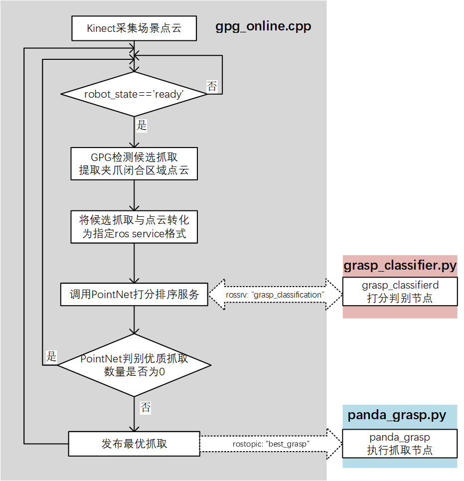

# GPG & PointNetGPD

## 1) Overview

本项目将[`Grasp Pose Generator(GPG, Andreas ten Pas)`](https://github.com/atenpas/gpg)与[`PointNetGPD(Hongzhuo Liang)`](https://github.com/lianghongzhuo/PointNetGPD)结合在一起，在线候选抓取采样使用GPG生成，然后使用PointNet对候选抓取进行打分排序，并执行最终排序最高的抓取。

本仓库做了如下调整修改：

1. 将原来的GPG抓取采样移植到了ROS框架中

2. 添加了桌面的检测剔除（可选），可剔除一些与桌面发生碰撞的抓取

3. 在`gpg_online.cpp`中以ros服务的形式调用了pointNet的打分服务，并最终把最优的抓取以话题形式发布出去

4. 添加了以`Franka Panda`机器人为平台的简单抓取脚本，可对检测出的最优抓取进行实际执行

   


## 2) 依赖(dependence)

1. [PCL 1.7 or later](http://pointclouds.org/)
2. [Eigen 3.0 or later](https://eigen.tuxfamily.org)


## 3) 安装(Install)

1. 打开终端，克隆本仓库到ros工作空间，并编译:

   ```
   cd ~/catkin_ws/src
   git clone https://github.com/Hymwgk/gpg.git
   cd ..
   catkin_make
   source ~/catkin_ws/devel/setup.bash
   ```


## 4) Panda抓取

注：在使用Panda机械臂进行调试的时候，没来得及写步骤，现在机械臂没在身边，这里就写个大概的步骤，具体的panda机械臂启动步骤可以参照我之前的项目

1. 启动panda机械臂

2. 启动kinect2相机

   ```bash
   roslaunch kinect2_bridge kinect2_bridge.launch publish_tf:=true
   ```

3. 进行抓取检测以及执行抓取

   ```bash
   roslaunch  gpg   kinect2PandaGrasp.launch
   ```

   


## 5) 参数(Parameters)

详细解释以及可调参数都在 *cfg/params.cfg*中


## 6) Citation

If you like this package and use it in your own work, please cite our [arXiv paper](http://arxiv.org/abs/1603.01564):

```
@misc{1603.01564,
Author = {Marcus Gualtieri and Andreas ten Pas and Kate Saenko and Robert Platt},
Title = {High precision grasp pose detection in dense clutter},
Year = {2016},
Eprint = {arXiv:1603.01564},
} 
```
