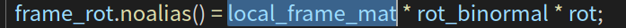
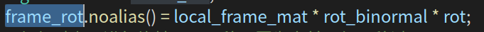

`FingerHand`对象代表的是夹爪本身；

局部坐标系

抓取参考坐标系，它和局部坐标系具有相同的原点（物体表面采样点），只是姿态不同，

局部参考坐标系的x轴就是物体的表面法向量，z轴是主曲率方向；`rot_binormal` 绕着binoraml方向，对局部坐标系旋转了180度，将x轴旋转了180度，得到了抓取参考坐标系，此时x轴是表面法向量反方向，作为抓取的approach轴，z轴逆转方向，但仍然与主曲率方向共线。之后`rot`使得抓取参考坐标系，绕着主曲率z轴旋转一个角度。

典范抓取坐标系是以`top_center`为原点、碰撞检测坐标系是以`bottom_center`为原点，这两个坐标系和局部参考坐标系都不相同，只在approach方向有一个偏移，但是表示的都是同一个抓取状态；

**所以在看待给定抓取时，需要明确知道，给定的抓取，使用哪个坐标系表示的。**

